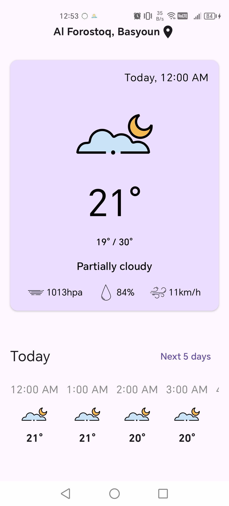

# 🌤️ Weather Tracker

## Overview
A modern Android application built with **Jetpack Compose** that fetches your real-time location and displays accurate weather information using a clean, user-friendly interface.

 

## ✨ Features

- ☁️ **Real-time Weather Data** with graceful UI states (Loading, Success, Error)
- 🧭 **Permission Handling** with smooth fallback UX
- 💡 **Offline Support** for cached data
- 🎨 **Jetpack Compose UI** with Material 3
- 🔐 Built with **MVVM**, and Clean Architecture

## Workflow for requesting permissions:
1. Checks location access permissions.
2. Checks if GPS is enabled:
   - If enabled, fetches the current location.
   - If disabled, attempts to use the last known location from cache.
3. Get the current weather data and 5-day forecast
4. The application has two screens: one for the current, refreshable weather, and another for the five-day forecast.
5. The application handles offline mode, which caches the last retrieved data locally

## 📸 Screenshots

  
  
  
  

## 🛠️ Tech Stack

* [Jetpack Compose](https://www.jetpackcompose.net)
* [Compose Navigation](https://developer.android.com/develop/ui/compose/navigation)
* [HttpUrlConnection](https://developer.android.com/reference/java/net/HttpURLConnection) - for making API calls
* [SQLite data store](https://developer.android.com/training/data-storage/sqlite) - for cacing weather data
* [Shared Preferences](https://developer.android.com/training/data-storage/shared-preferences) - for caching location coordinates and location name
* [FusedLocationProviderClient](https://developers.google.com/android/reference/com/google/android/gms/location/FusedLocationProviderClient.html)
* [Geocoder](https://developer.android.com/reference/android/location/Geocoder)