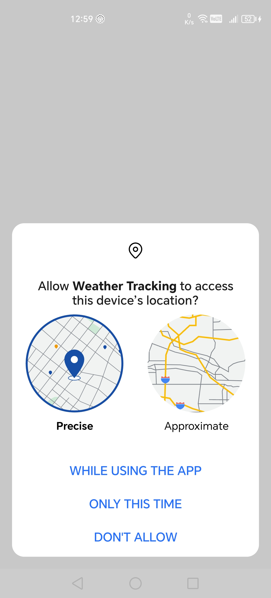
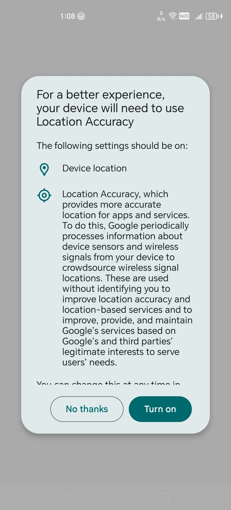

# Weather Tracking

## Overview
Weather Tracking is an Android application built with Kotlin and Jetpack Compose that displays real-time, location-based weather information. The app is designed with a clean architecture (MVVM) and uses only native Android components and APIs; no third-party libraries are used.

## Application Flow:
1. Checks the internet connection. If offline, it displays a toast message to the user.
2. Checks location access permissions.
3. Checks if GPS is enabled:
   - If enabled, fetches the current location.
   - If disabled, attempts to use the last known location from cache.
5. Get the current weather data and 5-day forecast
6. The application has two screens: one for the current, refreshable weather, and another for the five-day forecast.
7. The application handles offline mode, which caches the last retrieved data locally

## 📸 Screenshots

  
  
  
  
  

## Dependencies

Weather Tracking relies on the following key dependencies:
* [Jetpack Compose](https://www.jetpackcompose.net) 
* [Compose Navigation](https://developer.android.com/develop/ui/compose/navigation)
* [HttpUrlConnection](https://developer.android.com/reference/java/net/HttpURLConnection) - for making API calls
* [Shared Preferences](https://developer.android.com/training/data-storage/shared-preferences) - for local caching
* [Google Location service](https://developers.google.com/android/reference/com/google/android/gms/location/package-summary)

